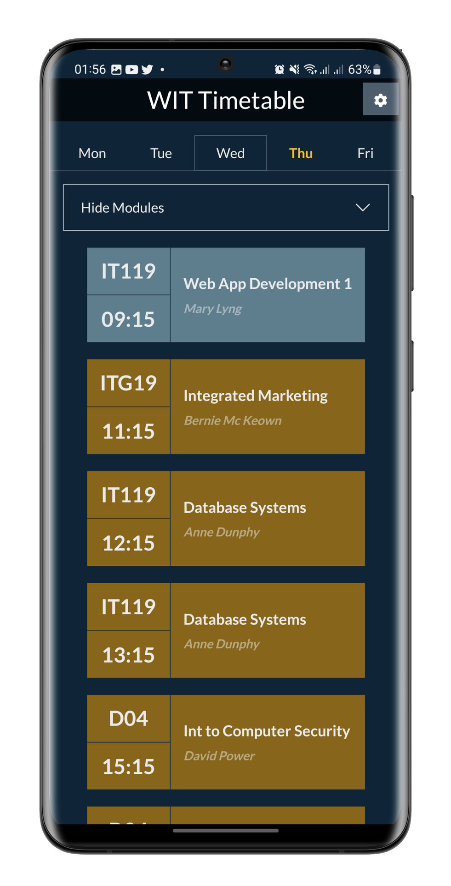

# Better WIT Timetable 

This is a nicer timetable for WIT. It's a work in progress, so it's not perfect yet.

The goal of the project is to make a timetable that is more user friendly and easier to use. It's also a good project for me to try Preact.

I wanted to focus on one main aspect: Only show what you need. This is why you can hide modules and only see what is on during one day at a time.

The app uses the timetable JSON generated from my [WIT Timetable Generator](https://github.com/piotrpdev/WIT-Timetable-Generator), this is much nicer than having to manually generate your timetable every week.

### Features

- [x] Responsive design
- [x] Dark mode
- [x] Hide modules
- [x] Colour indicates type e.g. Orange for Lab
- [x] Optional icons for the above
- [x] Automatically shows timetable for current day
- [x] Stores everything locally
- [x] Checks for new timetable when you open the app
- [ ] Nuclear launch codes

## Stack

- [Preact](https://preactjs.com/)
- [Bootstrap 4](https://getbootstrap.com/)

## License

This project is licensed under the MIT License - see the [LICENSE.md](LICENSE.md) file for details
